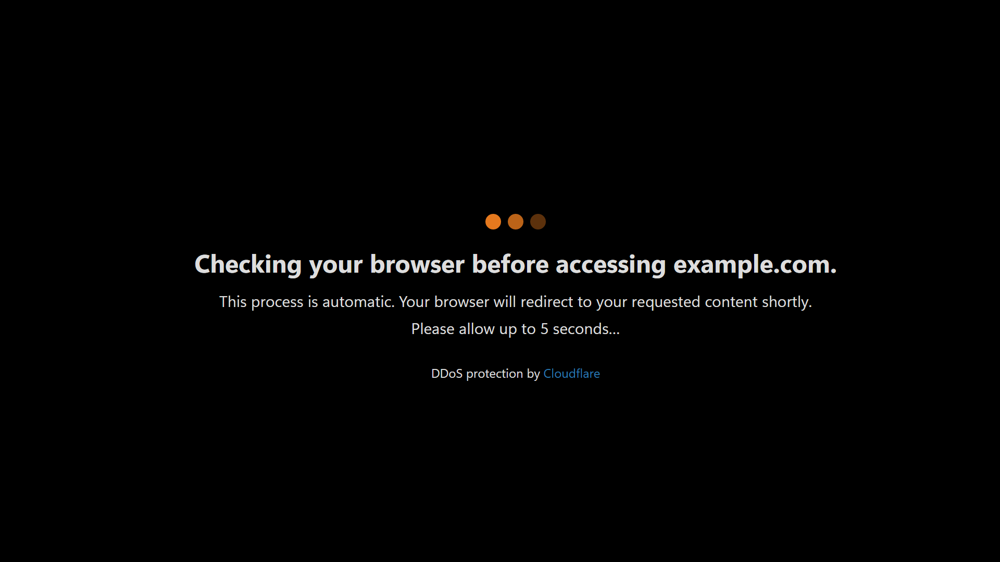
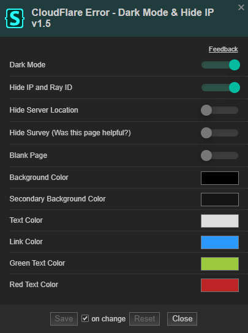

  <h1>CloudFlare Error - HIDE YOUR IP</h1>
  

 
(To install this style you need a <a href="https://github.com/openstyles/stylus#stylus">stylus extension</a>)

 

Webiste for testing: [CloudFlare Error page](https://pabli.dev/CloudFlareError/test), [DDoS Protection page](https://pabli.dev/CloudFlareError/test/ddos)

## License
[CC-BY-SA-4.0](https://github.com/pabli24/CloudFlareError/blob/main/LICENSE)

## My other userstyles
 [GreasyFork](https://greasyfork.org/users/124677-pabli) |  [UserStyles.world](https://userstyles.world/user/pabli) | 
 [UserStyles.org Archive](https://uso.kkx.one/browse/styles?search=%40291236)

